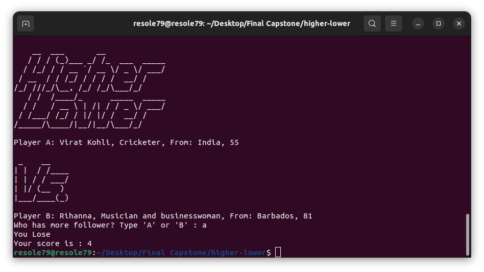

## Guess Number Game

Program for **Higher Lower Game**     
Higher Lower Game is easy to play, decide who has more follower.     
Try "**Higher Lower Game**" [here](http://www.higherlowergame.com/)     


###### It's a part of the **#100DaysOfCode** challenge by Angela Yu. ######


#### Installation
To get started with the "Higher Lower Game", follow these steps:

1. **Clone** the repository:

```sh
git clone https://github.com/resole79/higher_lower.git
```

2. **Run** the **higher_lower.py** file:

```sh
python3 higher_lower.py
```     

#### *File Structure*

 - **higher_lower.py**: Main program
 - **game_data.py**: File stores all the information
 - **art.py** : File contains the draws


#### **Usage**

```
    __  ___       __             
   / / / (_)___ _/ /_  ___  _____
  / /_/ / / __ `/ __ \/ _ \/ ___/
 / __  / / /_/ / / / /  __/ /    
/_/ ///_/\__, /_/ /_/\___/_/     
   / /  /____/_      _____  _____
  / /   / __ \ | /| / / _ \/ ___/
 / /___/ /_/ / |/ |/ /  __/ /    
/_____/\____/|__/|__/\___/_/     

Player A: Billie Eilish, Musician, From: United States, 61

 _    __    
| |  / /____
| | / / ___/
| |/ (__  ) 
|___/____(_)

Player B: Ariana Grande, Musician and actress, From: United States, 183
Who has more follower? Type 'A' or 'B' : 
```

**How program present**




## **Credit**

Author : Emilio Reforgiato (resole79)

##
<p align="right"><a href="https://www.linkedin.com/in/emilio-reforgiato/" target=”_blank” ></a></p>


